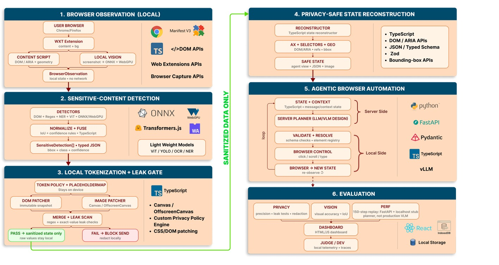
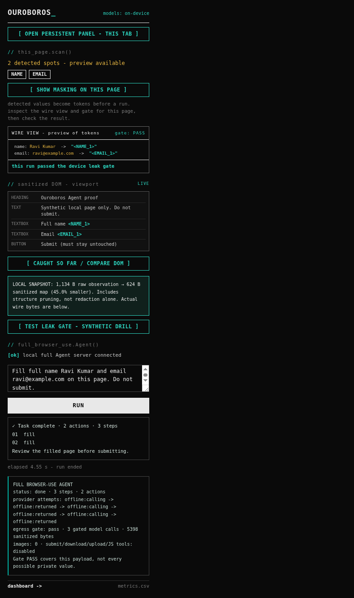
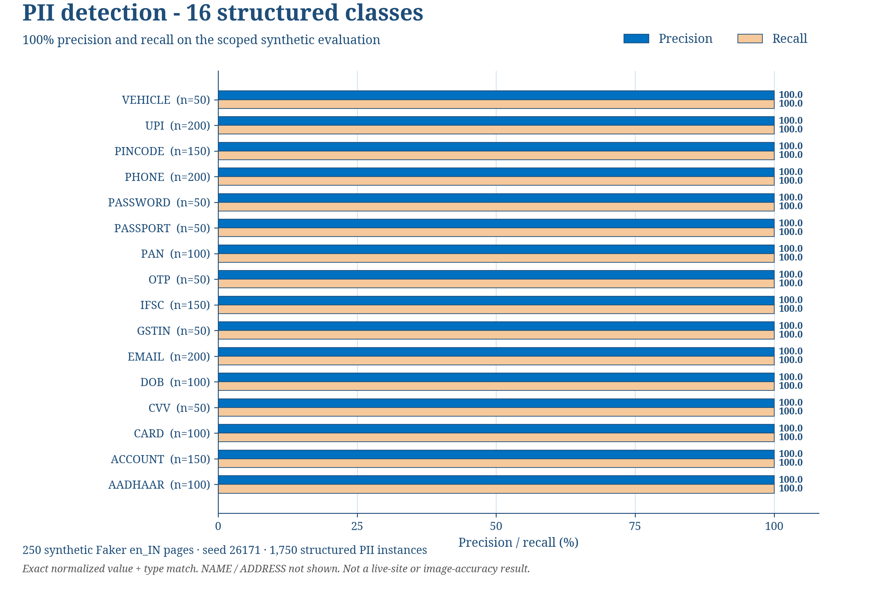

# Ouroboros

### On-device perception. Sanitized planning. Local browser actions.

Ouroboros is a browser-extension prototype for **SIH26171: On-device Visual Perception for Light-weight Browser Agents**. It puts a local perception and privacy layer between a web page and a server planner. The planner works with a compact screen map and typed placeholders; the client keeps the token-to-value map and restores values when applying an action.

The extension makes that process visible: inspect detected values, compare the observed DOM with the sanitized view, preview screenshot masking, and check the outgoing context in the wire panel.

[Architecture](#architecture) · [Screenshots](#see-it-working) · [Install](#install-and-build) · [Run](#run-a-task) · [Evidence](#measured-evidence) · [Evaluation](#reproduce-the-evaluations)

## What is in this repository

- Chrome and Firefox extension builds, with a shared TypeScript observation and action pipeline.
- Local pattern/checksum detection, compact NER, OCR and face detection.
- Stable typed tokens such as `<EMAIL_1>`, `<PAN_1>` and `<AADHAAR_1>`.
- A leak gate that checks serialized context against known values and detection rules before sending.
- A FastAPI planner interface, local action validation, token restoration and per-stage metrics.
- Synthetic evaluation scripts, captured public-page evidence and a browser task fixture.

**Branch guide:** `main` contains the extension and hybrid `/step` loop. The newer popup-driven Agent panel and provider chain shown below live on `feat/overnight-sih-demo-20260930`. This README review branch is based on main; it adds documentation and images, not runtime changes. Use the demo branch for the full-Agent setup.

## Architecture



The diagram describes the client/server design. Its planner block is a design boundary, and the performance replay pictured in the evaluation block uses a localhost stub planner.

1. **Observe locally.** Read visible page elements, accessible labels and geometry. Capture visual regions when needed.
2. **Detect sensitive content.** Combine field rules, patterns and checksums with NER; use OCR and face detection for visual content.
3. **Tokenize and check.** Replace detected values with session-stable typed tokens. Check the exact outgoing context before it is sent.
4. **Build a useful screen state.** Keep roles, labels, element references and geometry alongside sanitized text and masked visual context.
5. **Plan and execute.** A server planner proposes actions. The client checks the action and current element, restores tokens locally where needed, then observes the new state.
6. **Record evidence.** Collect stage timings, payload sizes and gate results for the dashboard and evaluation files.

The privacy boundary is enforced by detection and validation, not by the planner being trustworthy. A gate PASS is a result for the checked payload against the available checks, not a guarantee about every possible private value. Original page data remains available to the local browser while the agent receives a sanitized representation.

For the detailed interfaces, see [ARCHITECTURE.md](docs/ARCHITECTURE.md) and [PAYLOAD-SCHEMA.md](docs/PAYLOAD-SCHEMA.md).

## See it working

### Popup Agent panel and sanitized wire view



Captured from the demo branch on the shipped synthetic local proof page. The task filled a name and email without pressing Submit. The panel shows typed tokens, the sanitized DOM, the action result and the gated context trace. This capture used the offline test provider; it demonstrates the integration path, not live-provider task accuracy.

### A real public page, before and after masking

| Local page capture | Masked copy |
| --- | --- |
|  |  |

These are paired captures of the actual LinkedIn signup page with synthetic test inputs. No account was created and no form was submitted. The masked image removes the visible test email while keeping the page's layout. The original browser page is not replaced by this image. [Public-page method and raw evidence](docs/PHASE11-REAL-PAGES.md).

## Install and build

Use Node.js 22 and npm. The Python hybrid server uses Python 3.11; the demo Agent setup uses Python 3.12. Clone the repository through your own GitHub access, then:

```bash
npm ci
npm run typecheck
npm test
```

### Stage the on-device models

From a Bash shell at the repository root:

```bash
bash scripts/fetch-models.sh
bash scripts/stage-models.sh --ner=bundled
WXT_NER_SOURCE=bundled npm run build --workspace extension
```

The fetch script downloads the NER, PaddleOCR and YuNet artifacts into the ignored `models/` directory. Staging copies them and the ONNX runtime files into the extension. Model binaries are not stored in Git. Bundled NER loads from the extension's own origin.

Windows users can run the Bash steps in Git Bash. For PowerShell builds after staging:

```powershell
$env:WXT_NER_SOURCE = "bundled"
npm run build --workspace extension
```

The extension build script produces both browser targets:

| Browser | Load for development |
| --- | --- |
| Chrome | Open `chrome://extensions`, enable Developer mode, choose **Load unpacked**, and select `extension/.output/chrome-mv3`. |
| Firefox | Open `about:debugging`, choose **This Firefox > Load Temporary Add-on**, and select `extension/.output/firefox-mv2/manifest.json`. |

```bash
npm run zip --workspace extension
```

This creates browser-specific ZIP bundles in the WXT output directory. [Firefox build and installation evidence](docs/FIREFOX.md) distinguishes the browser build/install checks from the Chromium interactive-task evidence.

## Run a task

### Main branch: hybrid extension loop

Start the planner and the inspecting local proxy in separate terminals:

```bash
python -m pip install -r server/requirements.txt
python -m uvicorn app.main:app --port 8001 --app-dir server
```

```bash
python demo/trust_proxy.py 8000 http://127.0.0.1:8001
```

Serve the synthetic fixture in a third terminal:

```bash
python -m http.server 8089 --directory demo
```

Open `http://localhost:8089/kyc.html` in the browser with the extension loaded. Inspect detection, the masking preview and the wire panel. Use a bounded instruction such as:

> Fill the KYC form from my saved profile. Do not submit.

The default `/step` server is a deterministic stub for reproducible loop testing. For an open-weights VLM endpoint, the server supports `PLANNER=vlm` and `VLM_BASE_URL`; see [the planner experiments](docs/PHASE9.md) and [the hybrid harness](demo/README.md). Keep the task fixture on `localhost`.

### Demo branch: popup Agent with Cloudflare first

```bash
git switch feat/overnight-sih-demo-20260930
python -m pip install -r server/requirements-general.txt
```

Build and load that branch's extension with the staged models. Create a local `.env` in the repository root. Keep credentials on your own machine and out of Git, screenshots and logs. The source loader accepts plain `KEY=value` lines.

```dotenv
OURO_PROVIDER_ORDER=cloudflare,groq
CLOUDFLARE_ACCOUNT_ID=YOUR_ACCOUNT_ID
CLOUDFLARE_API_TOKEN=YOUR_LOCAL_TOKEN
CLOUDFLARE_MODEL=@cf/meta/llama-3.3-70b-instruct-fp8-fast
GROQ_API_KEY=YOUR_OPTIONAL_LOCAL_KEY
GROQ_MODEL=openai/gpt-oss-120b
OURO_CDP_URL=http://127.0.0.1:9222
OURO_CHROME=YOUR_INSTALLED_CHROME_EXECUTABLE
OURO_AGENT_MAX_STEPS=12
```

This configuration uses an open-weights Cloudflare model first and an optional open-weights Groq fallback. Remove `groq` from the order to use Cloudflare alone. It deliberately does not select the proprietary-model adapters that also exist in the source. Account access, quotas and structured-output support are provider-specific.

```bash
python demo/run_agent_server.py
```

The launcher opens a dedicated visible Chrome profile and starts the local Agent service on port 8000. Load the extension in that browser, open the target page, enter a bounded task in the popup and press **RUN**. Keep the terminal open. Use synthetic or public data for demonstration and review the resulting fields before any submission. Keep the local debugging port private.

## Measured evidence

| Measurement | Recorded result | Scope and evidence |
| --- | --- | --- |
| Structured-data detection | **100% precision / 100% recall across 16 classes** | 250 synthetic Faker en_IN pages, seed 26171; 1,750 structured instances. Exact normalized value and type match. [Raw JSON](eval/results/rules-ner-250.json). |
| Controlled test-canary gate | **0 leaking payloads passed that gate** | 400 synthetic pages / 2,750 planted values: the 250-page set plus three 50-page adversarial sets. This gate has ground-truth canaries; it is separate from the production gate. |
| Payload minimization | **74-95% smaller sanitized representations** | Four live pages: Zerodha, Groww, Flipkart and LinkedIn. Comparison is with rendered DOM bytes, including structure pruning, not redaction alone. [Capture script](eval/src/datared-real.ts). |
| Local detector model artifacts | **39.2 MB** | NER, OCR detector/recognizer and YuNet combined, rounded; excludes runtime WASM, caches, resident memory and the optional screen classifier. [Resource scope](docs/PHASE12-BENCHMARKS.md). |



The chart covers Aadhaar, account, card, CVV, DOB, email, GSTIN, IFSC, OTP, PAN, passport, password, phone, pincode, UPI and vehicle registration. NAME and ADDRESS are outside this chart's denominator. These are synthetic detector results, not a live-site or screenshot-accuracy score.

The controlled gate totals are the sum of [250-page results](eval/results/rules-ner-250.json), [seed 777](eval/results/rules-ner-adversarial-777.json), [seed 778](eval/results/rules-ner-adversarial-778.json) and [seed 779](eval/results/rules-ner-adversarial-779.json). The raw files retain production-gate and test-canary-gate fields separately.

## Reproduce the evaluations

Run from the repository root after `npm ci` and model fetching. These commands were checked against the package scripts and source; this README update did not rerun the benchmarks.

```bash
# Rules baseline and rules + NER, including per-class JSON
npm run metrics --workspace eval -- 250

# Three controlled adversarial sets
npm run metrics --workspace eval -- adversarial 777
npm run metrics --workspace eval -- adversarial 778
npm run metrics --workspace eval -- adversarial 779

# Screen-map evaluation
npm run screenmap --workspace eval

# Local OCR / face-detection resource probe
npm run bench --workspace eval
```

Results are written under `eval/results/`. The NER row is included when the model artifact is present. The runner's adversarial mode takes the seed as its second argument and uses 50 pages per run.

For a loop-timing replay, run the stub server on port 8000 in one terminal:

```bash
python -m uvicorn app.main:app --port 8000 --app-dir server
```

Then, in another:

```bash
npm run replay --workspace eval -- 150
```

Replay writes CSV and Markdown metrics. It measures a localhost stub loop, not production VLM latency. The public-page payload script requires the observation bundle at `/tmp/rp-inpage.js`, a Chrome executable and its output directory; inspect those paths before running it on another machine. For actual desktop resource collection, follow [the device benchmark protocol](eval/device-bench/README.md).

## Project structure

```text
extension/       WXT extension, content/background scripts, popup and metrics UI
packages/core/   Observation types, detectors, token map, gate and action validation
packages/ner/    Compact named-entity model integration
packages/vision/ OCR, face detection and image masking
server/          FastAPI planner interface and Python tests
demo/            Synthetic task fixtures, proxy and browser harness
                 Demo branch also contains the full-Agent service launchers
eval/            Generators, scoring, benchmark scripts and raw result files
scripts/         Model downloads and extension staging
docs/            Architecture, payload schema, experiment notes and screenshots
notebooks/       Planner/compute experiment notebooks
```

## Development checks

```bash
npm run typecheck
npm test
npm run build --workspace extension
python -m pip install -r server/requirements-dev.txt
python -m pytest server -q
```

The README review is documentation-only. The base main commit `458ec96` passed the existing TypeScript/build and Python CI checks. This branch does not change the provider runtime, release builds or browser permissions.
