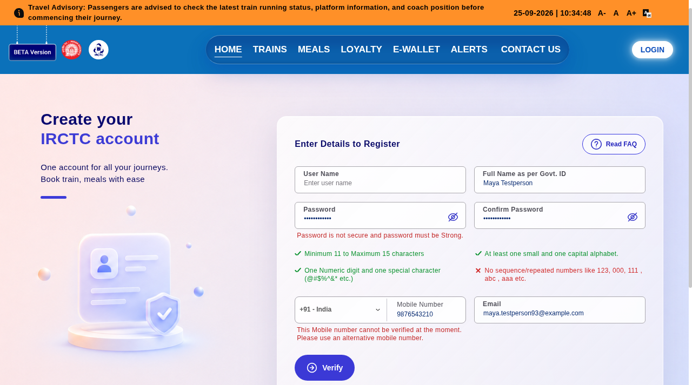
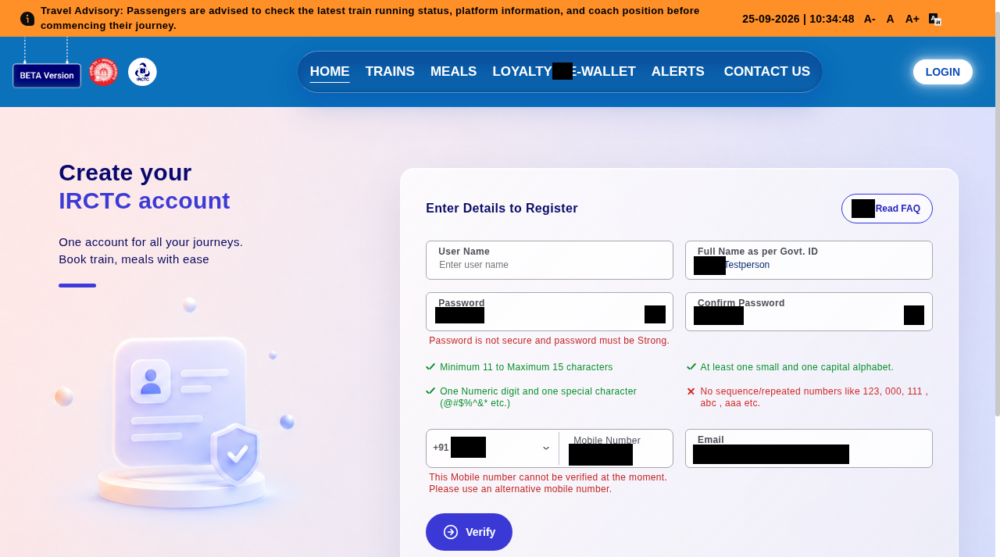
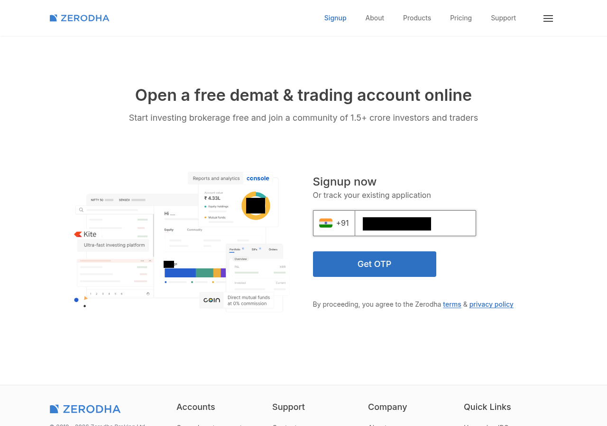

# Phase 11 - Public real-page tests (25 September 2026)

## Verdict

Ouroboros masked every synthetic field value on the seven *completed* live-page runs: 13/13 DOM values found and masked, zero verbatim values in serialized screen maps. The image path had 10 OCR-readable values before masking and zero readable afterward. These are small, opportunistic tests on public first-step pages, not an end-to-end KYC validation or a security guarantee. No form was submitted, no account was created, and all typed data was synthetic.

The public-page sweep also exposed a product cost: false masks of public page text. Zerodha's local run masked 6 unrelated spans (including company contact addresses and footer text), and Flipkart 13. A protected value that escapes OCR on a blurred card is still an unresolved limitation from Phase 10, even though the gate stopped the known cases. Real ID photos, authenticated KYC steps, mobile/WebGPU performance, and real-page VLM navigation remain unmeasured.

## Method and denominator

The local harness opened 22 public URLs in Chrome at 1280 x 900, seeded Faker en_IN at 1101, filled recognized visible text inputs, and never clicked submit. It observed the DOM, ran rules plus NER, serialized the sanitized screen map, checked typed values independently, then OCR-masked a viewport PNG twice and re-read it. An initial harness exception in false-mask diagnostics affected three pages and is *not* counted as a completed image run. A cloud-browser fallback reached IRCTC's live beta registration form and two other forms with synthetic unsent inputs. Cloud-browser fills were through regular UI controls; the observation and image path ran locally from the captured artifacts. The cloud synthetic test values are not part of the local seed.

| Completed page | Route | DOM values masked | Raw values in wire | OCR readable before -> after | Sanitize ms | Vision ms |
|---|---|---:|---:|---:|---:|---:|
| IRCTC beta registration | cloud fallback | 5/5 | 0 | 3 -> 0 | 436 | 5139 |
| Zerodha signup | local | 1/1 | 0 | 1 -> 0 | 407 | 2130 |
| Groww login | local | 1/1 | 0 | 1 -> 0 | 35 | 1281 |
| Flipkart signup | local | 1/1 | 0 | 1 -> 0 | 182 | 4730 |
| LinkedIn signup | local | 2/2 | 0 | 1 -> 0 | 107 | 2737 |
| Zerodha signup | cloud fallback | 1/1 | 0 | 1 -> 0 | 405 | 1899 |
| Naukri registration | cloud fallback, two fields only | 2/2 | 0 | 2 -> 0 | 219 | 3547 |

The image OCR total is **10 before -> 0 after**. It counts repeated site runs separately. Three values had no full-string OCR match before masking, so they cannot demonstrate OCR recall. Passwords were excluded from visible-image counts. This is exact-value readability, not a pixel-proof of every character.

Across the local 22-URL attempt: four completed with filled fields and image results; two more had masked DOM values but image evaluation failed due to harness exceptions (Naukri 4/4, Bajaj Finserv 1/1). The other sixteen did not yield a completed filled-form evaluation. Several were redirects, 404s, pages without visible form fields, page-loading failures, or anti-bot blocks. IRCTC legacy URL returned 403 locally but its linked beta signup worked in the cloud browser. ABHA returned CloudFront 403 in both routes; GitHub signup hit DataDome's block in the cloud browser; neither is scored. The original DigiLocker URL redirected to a newer flow. Do not turn an inaccessible page into a passing test.

## What the screenshots show

- IRCTC beta: synthetic full name, password/confirmation, mobile, and email on the real registration form. The phone field displayed a validation warning, which reinforces why no registration was attempted.
- Zerodha: synthetic mobile number in the actual signup field; the masked copy removes the number while retaining context.
- Naukri: synthetic full name and mobile number. Email and password controls appeared read-only to the browser's form input, so those values were not forced into the page; this is a two-field run, not a four-field one.

See `eval/results/realpages-local/results.json`, `eval/results/realpages-cloud/*.json` and the corresponding `*-filled.png` / `*-masked.png` files. The reproducible harness is `eval/src/realpages.ts` and `eval/src/process-cloud.ts`. The local images are evidence of the page state, not proof that the sites accepted the synthetic values in a backend.

## Visual evidence

## Limits and next measurements

1. False-positive precision needs a truth-annotated public-page corpus, not just counts. Footer addresses and public contact emails may be intentionally masked by broad PII policy; the claimed precision depends on what the benchmark labels as sensitive.
2. Fix harness diagnostic crashes and rerun Naukri/Bajaj Finserv on a fresh seed. Also verify the DOM test against text outside input values and user-uploaded files, neither covered here.
3. The Kaggle VLM endpoint was down during this run; the notebook URL currently rendered a "can't find that page" response in the available cloud browser. No real-page VLM task-completion result is claimed. Restoring a fresh free GPU session, and using a no-submit planner policy, remains pending.
4. Run real-page navigation without submitting, then test authenticated KYC only with an explicitly safe account and final-stage consent. Do not substitute synthetic happy-dom successes for real-site completion.
5. Observe device CPU, memory, battery, and WebGPU on a real client; current figures are the shared CPU sandbox plus browser capture overhead.

No paid service or paid compute used in this phase.
